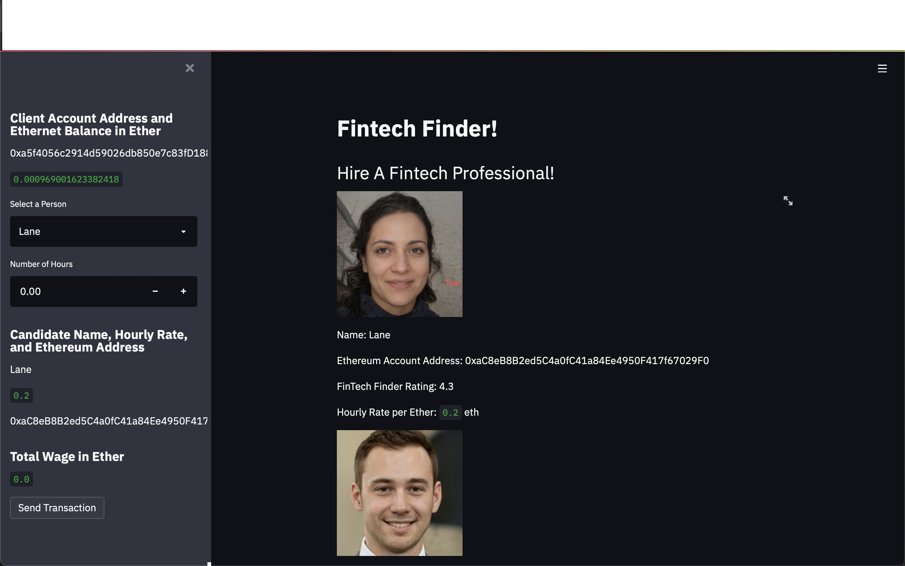
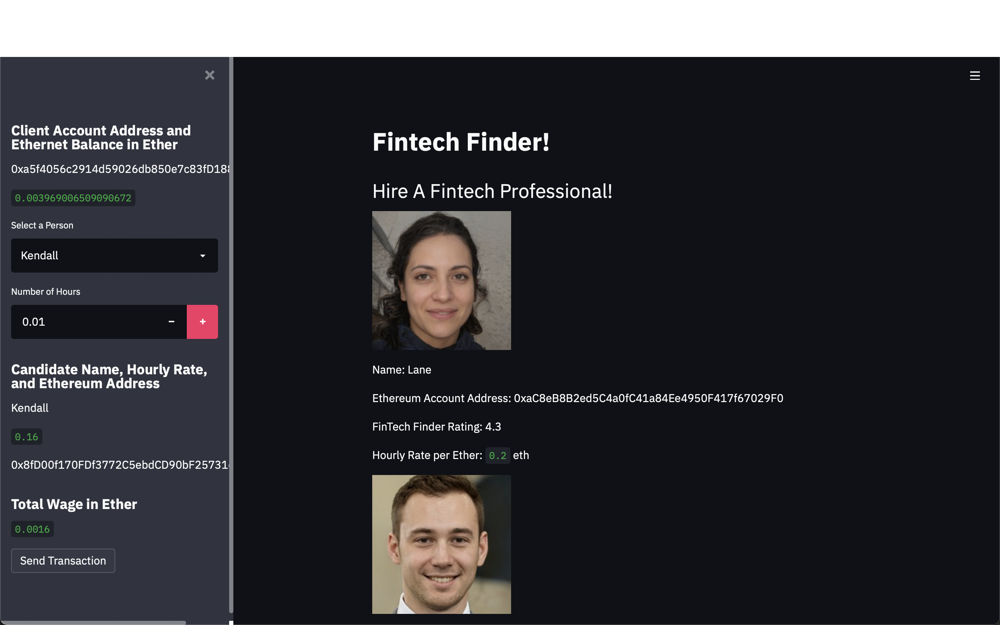
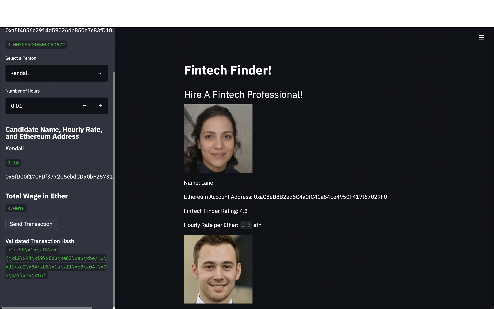
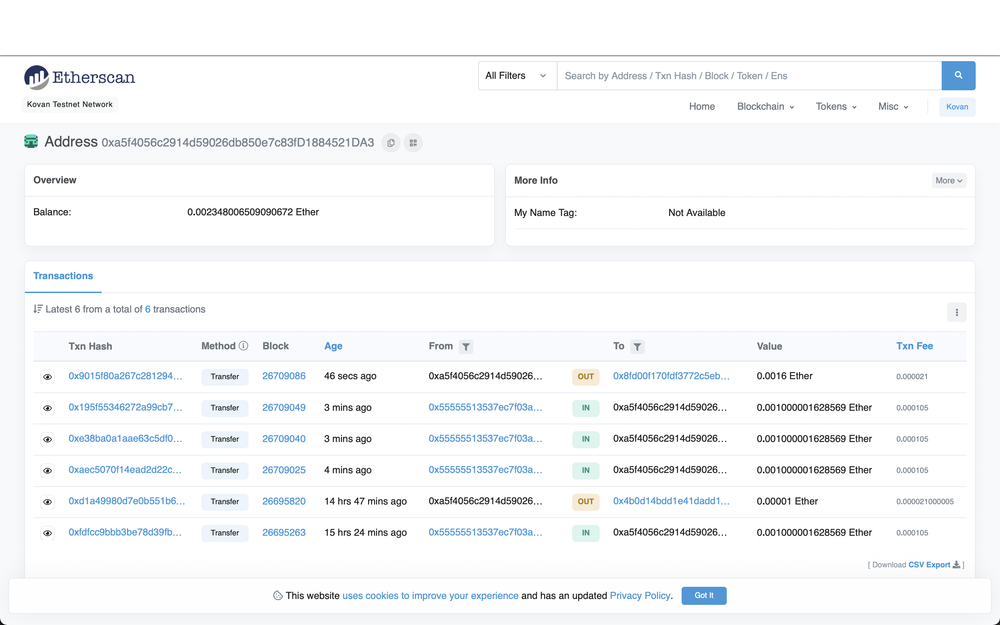
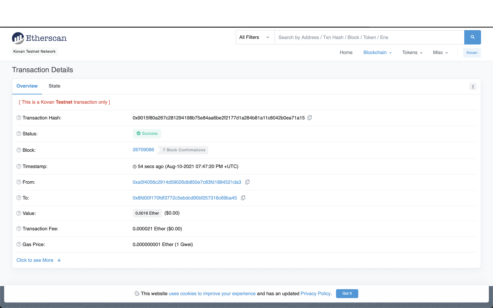
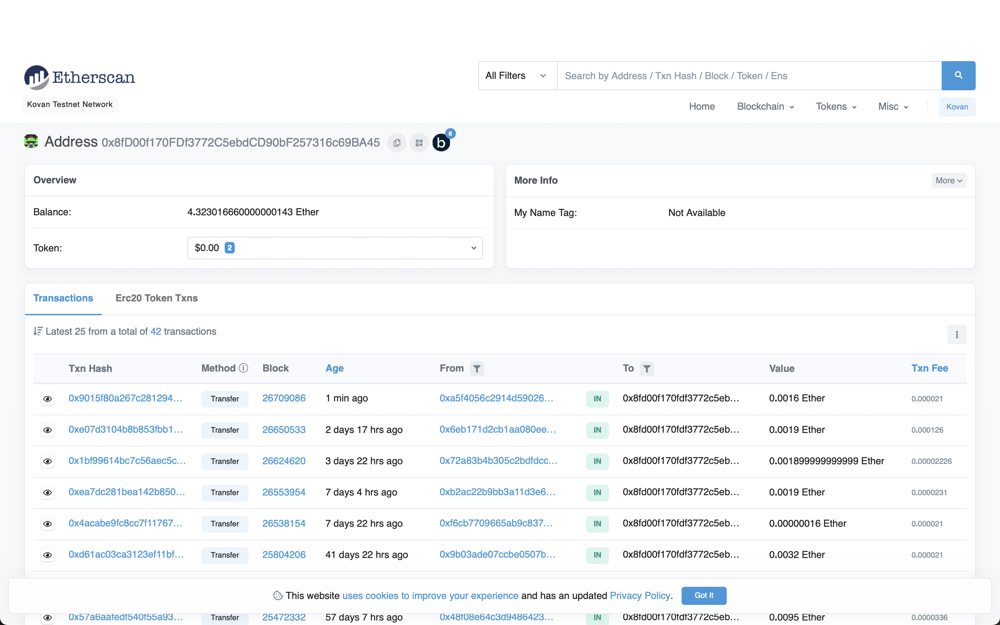

### Fintech Finder Application 

**Overview of the project and project goals**

Fintech Finder is an application that customers can use to find fintech professionals from among a list of candidates, hire them, and pay them. This application works by integrating the Ethereum blockchain network into the application in order to enable customers to instantly pay the fintech professionals whom they hire with cryptocurrency.


## Set Up Python Modules and Libraries

*To install the Web3.py library, check that your dev environment is active, and then run the following:*
```
pip install web3==5.17
```
* [Web3.py](https://web3py.readthedocs.io/en/stable/overview.html) - A Python library for connecting to and performing operations on Ethereum-based blockchains.

*To install the ethereum-tester library, check that your dev environment is active, and then run the following:*
```
pip install eth-tester==0.5.0b3
```
* [ethereum-tester](https://pypi.org/project/ethereum-tester/0.1.0a4/) - A Python library that provides access to the tools we’ll use to test Ethereum-based applications.

*To install the mnemonic package, check that your dev environment is active, and then run the following:*
```
pip install mnemonic
```
* [mnemonic](https://pypi.org/project/mnemonic/) - A Python implementation for generating a 12- or 24-word mnemonic seed phrase based on the BIP-39 standard.

*To install the bip44 package, check that your dev environment is active, and then run the following:*
```
pip install bip44
```

* [bip44](https://pypi.org/project/bip44/) - A Python implementation for deriving hierarchical deterministic wallets from a seed phrase based on the BIP-44 standard.

*To connect with the Ethereum network over the web, create a free account with Infura.*
* [Infura API](https://infura.io) - An API that provides instant access to the Ethereum network over HTTPS (i.e., the web). You will need to create an account with Infura.


## Required Dependencies 

```
import os
import requests
from dotenv import load_dotenv
load_dotenv()
from bip44 import Wallet
from web3 import Account
from web3.auto.infura.kovan import w3
from web3 import middleware
from web3.gas_strategies.time_based import medium_gas_price_strategy
import streamlit as st
from dataclasses import dataclass
from typing import Any, List
```


## Installation

1. Clone repo from GitHub to your computer:

```
git clone https://github.com/JonahLeggett/Fintech_Finder.git
```


## Run Streamlit

1. Navigate to the 'Fintech_Finder' local repo folder in terminal.

2. Run the following command in terminal:

```
streamlit run fintech_finder.py
```


## Instructions (With Screenshots) for Using Streamlit Application

**Send a test transaction by using the application’s web interface, and then
look up the resulting transaction hash on the Kovan Etherscan block explorer
to verify the transactions.**

Complete the following steps:

1. From terminal, navigate to the project folder that contains
the `.env` file and the `fintech_finder.py` and `crypto_wallet.py` files.

2. To launch the Streamlit application,
type `streamlit run fintech_finder.py`.



3. On the resulting webpage, select a candidate that the customer would like to hire
from the appropriate drop-down menu. Then, enter the number of hours that they
would like to hire them for. (Remember to check the balance of the account to ensure 
you have enough to pay them.)



4. Click the Send Transaction button to sign and send the transaction with
the Ethereum account information. If the transaction is successfully
communicated to the Ethereum Kovan testnet, validated, and added to a block,
a resulting transaction hash code will be written to the Streamlit
application sidebar.



5. Copy the customer’s Ethereum address from the Streamlit application
page, and navigate to [Kovan Etherscan](https://kovan.etherscan.io/).
Paste the copied Ethereum address into the Kovan Etherscan search bar.

    

6. To view transaction details, on the Kovan Etherscan page, click on the Txn Hash number associated with
the transaction that paid the Fintech Finder candidate.

   

7. View the transaction details on the receiver's wallet to ensure transaction completed properly.

  
 


## License

MIT